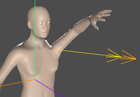
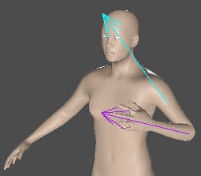

---

# Mobius-Cone: A Biomimetic Manifold Framework for Singularity-Free Motion Control
**Project Name:** Mobius-Cone-IK
**Author:** [creatxrgithub](https://github.com/creatxrgithub)
**Field:** Computer Graphics / Biomechanics / Robotics Control

---

## 1. Abstract
This paper introduces the "Mobius-Cone" motion control framework, designed to fundamentally resolve the issues of Gimbal Lock and geometric singularities in 3D skeletal systems during extreme poses. The framework posits that limb movements are synthesized from **Swing (angular deviation)** and **Rotation (axial twist)** relative to specific centerlines. By flexibly configuring "External" and "Local" reference axes under a "Heading-based" navigation system and incorporating a **"Behavior Allocation & Stacked Execution"** pipeline, this model achieves a topologically continuous motion mapping that aligns with biological intuition and engineering scalability.

---

## 2. Nomenclature and Intuition
The core inspiration originates from the topological properties of the **Möbius strip**.

In biological dynamics, the movement of any skeletal limb involves a bone changing its angle (Swing) and rotational degree (Twist) relative to a specific centerline.
* **Inversion Property:** Visually, the activity space of each bone is not a simple cone but a manifold that continuously inverts its "inner" and "outer" sides during rotation.
* **The Mobius-Cone:** This motion trajectory—constrained by anatomy and possessing manifold continuity—is defined as a **"Mobius-Cone."**

---

## 3. Heading-based Navigation and Dual-Reference Design

### 3.1 Heading-based Dynamic Coordinates
To ensure stable navigation in any 360-degree orientation, the system defines an "instantaneous heading basis" by sampling body features (e.g., C7 vertebra, acromion, chin). Commands are relative to the subject's current "Forward/Backward/Left/Right" rather than global world coordinates, avoiding singularities caused by world axis alignment during complex maneuvers.



### 3.2 Adaptive Axis Configuration
* **Shoulder Cone (External Reference):** The centerline is fixed at a specific offset relative to the "Heading Basis" (e.g., a **35°** lateral offset for the left shoulder). This provides a stable "geometric pedestal" that does not flip with the bone's self-rotation.
* **Elbow Cone (Local Body Reference):** The axes are defined directly on "Local" bone segment vectors (Elbow $\to$ Wrist and Elbow $\to$ Shoulder), allowing for the precise non-coaxial synthesis of forearm rotation and flexion.



---

## 4. System Architecture: The Allocation and Execution Pipeline

`Mobius-Cone-IK` ensures motion fluidity and composability through a decoupled strategy:

1.  **Behavior Allocation Layer:** Behavior functions (e.g., `apply_mobius_behavior_xxx`) **do not execute** movements. Instead, they assign parameters to "Bone Node" objects based on intent (Context) and push them into the `node_config` stack.
2.  **Trajectory Coordination Layer:** During parameter passing, "Coordinator" functions are called to handle time-domain smoothing, velocity sequence allocation (e.g., 30% Slow - 40% Fast), and physical damping at geometric boundaries.
3.  **Stacked Execution Layer:** A universal FK execution function iterates through the configuration stack, performs geometric synthesis, and drives the skeletal matrices.

---

## 5. Core Geometric Implementation

### 5.1 Coordinate-Agnostic Local Basis Construction (Algorithm 001)
This is the **geometric origin** of the framework. It utilizes a "Minimum Component Perturbation" method to dynamically generate an orthogonal auxiliary axis $u$, ensuring that cross-product operations never degrade, regardless of orientation.

```gdscript
static func get_bone_mobius_cone_quaternion(skel: Skeleton3D, bone_name: String, rotate_angle: float, swing_angle: float, center_axis: Vector3) -> Quaternion:
    var bone_idx = skel.find_bone(bone_name)
    if bone_idx == -1: return Quaternion.IDENTITY

    var r_rad = deg_to_rad(rotate_angle)
    var s_rad = deg_to_rad(swing_angle)
    var n = center_axis.normalized()

    # Dynamic Basis Construction
    var u: Vector3
    var abs_n = n.abs()

    # Perturb the smallest component to ensure a non-zero cross product
    if abs_n.x <= abs_n.y and abs_n.x <= abs_n.z:
        u = n.cross(Vector3(n.x + 1.0, n.y, n.z)).normalized()
    elif abs_n.y <= abs_n.z:
        u = n.cross(Vector3(n.x, n.y + 1.0, n.z)).normalized()
    else:
        u = n.cross(Vector3(n.x, n.y, n.z + 1.0)).normalized()

    var q_swing = Quaternion(u, s_rad)
    var q_rotate = Quaternion(n, r_rad)
    return q_rotate * q_swing
```

### 5.2 Bone Segment Vector Extraction (Algorithm 003)
Extracts robust direction vectors from the Rest Pose, handling cases of geometric degradation (overlapping bones).
```gdscript
static func get_bone_segment_vector(skel: Skeleton3D, p_name: String, c_name: String) -> Vector3:
    var rel_pos = skel.get_bone_rest(skel.find_bone(c_name)).origin
    if rel_pos.length() < 0.0001:
        return skel.get_bone_rest(skel.find_bone(p_name)).basis.y.normalized()
    return rel_pos.normalized()
```

---

## 6. Standardized Interface and Execution Specification

### 6.1 Atomic Behavior Allocator
Behavior functions are responsible solely for parameter assignment and pre-processing.

```gdscript
# Algorithm 011: Behavior Function Example
static func apply_mobius_behavior_xxx(skel: Skeleton3D, context: Dictionary, node_config: Array, coordinator: Callable = Callable()) -> Array:
    # Assign parameters to node_config based on intent (Context)
    var node = {
        "bone_name": context.get("bone_name"),
        "bend": context.get("target_bend"),
        "rotation": context.get("target_rotate"),
        "axis_rotate": context.get("axis"), # If null, identified by executor
        "speed": context.get("speed", 0.1)
    }
    # Call coordinator for secondary adjustments (clamping, damping, etc.)
    if coordinator.is_valid():
        node = coordinator.call(node, context)
    node_config.append(node)
    return node_config
```

### 6.2 Stacked FK Executor
The executor iterates through the `node_config` stack to synthesize the final physical transform.

```gdscript
# Algorithm 015: Stack Execution Function
static func execute_fk_stack(skel: Skeleton3D, node_config: Array):
    for node in node_config:
        var b_idx = node.get("bone_idx", skel.find_bone(node.bone_name))

        # 1. Acquire Centerline: Prioritize axis_func, fallback to bone identification
        var center_axis = node.get("axis_rotate", Vector3.UP)

        # 2. Calculate Trajectory: Use pre-calculated target_quaternion or compute live
        var target_q = node.get("target_quaternion",
            get_bone_mobius_cone_quaternion(skel, node.bone_name, node.rotation, node.bend, center_axis)
        )

        # 3. Trajectory Coordination and Velocity Allocation
        var current_q = skel.get_bone_pose_rotation(b_idx)
        var final_q = current_q.slerp(target_q, node.get("speed", 0.1))

        skel.set_bone_pose_rotation(b_idx, final_q)
```

---

## 7. Conclusion
The Mobius-Cone framework demonstrates that by decoupling "Decision Allocation" from "Unified Execution," the scalability and stability of 3D animation systems are significantly enhanced. This model not only eliminates gimbal lock at a geometric level but also establishes a high-efficiency, stackable standard for atomic behavior management in engineering.

---

## 8. References
1.  **Aristidou, A., et al. (2018).** *Inverse Kinematics: Techniques and Applications.*
2.  **Park, F. C., & Lynch, K. M. (2017).** *Modern Robotics: Mechanics, Planning, and Control.*
3.  **Kuffner, J. (2004).** *Effective sampling and distance metrics for 3D rigid body configurations.*

---
